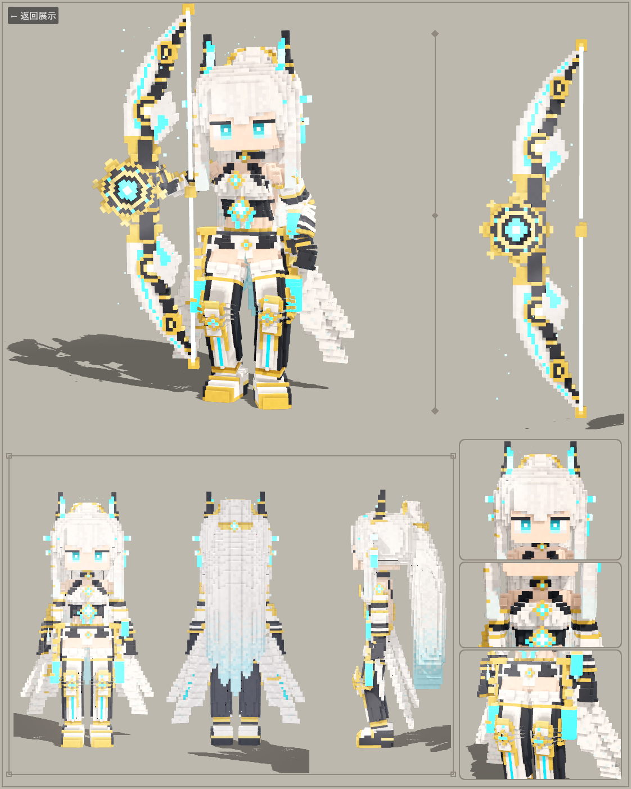

# 超次元工坊 · 体素 3D 自走棋 roguelite（Godot 4.5 Demo）

你是**工坊主**：开着一辆能穿越次元的重型运货卡车，货厢里的多元空间装着无数模仿人类职业制造的人形机械生命——**节点**。
在随机生成的地图上开车前进(《杀戮尖塔》式路线)，每到一个地图节点商店免费刷新(《云顶之弈》式运营)，
在节点上用摆在卡车四周的节点们迎战从四面八方涌来的怪物；卡车是战场中央的掩体，我方全灭后怪物会冲进货厢扣**卡车耐久**。
当前内容：**第零章 · 白之章**——俯视角的体素大地图上 3 个奖励节点(虚线连接，点图标出发)，击杀怪物掉落晶球(金币 / 节点 / 武器)，打完提示"游戏结束"。

- **全 3D 体素自走棋**：棋子只在**开局摆放**时受格子限制，战斗中自由走位、风筝、绕后、追击；断壁残垣挡路，高的还挡视线与弹道。
- 所有"效果"都必须由**触发器**触发——单位提供触发器，武器提供不完整的效果载荷，配对才生效。
- **装备就是武器**：9 个武器大类(剑/长枪/大剑/双匕/弓/手弩/双枪/步枪/法器)决定射程、普攻倍率和普攻动作，并直接显示在模型手里；
  没装备时拿着朴素的基础武器(木弓、铁剑…)。
- 棋子模型：大部分棋子用下面这个 **Q 版体素弓箭手**（同一套骨骼 + 武器外观 + 8 色换色）；
  起舞节点、连射节点、护理节点有**专属体素模型**(同一副骨骼、同样的画风，`tools/model_chars.gd`)。
  每个棋子有自己的发色(本色系里任选)与肤色，每个模型的眼睛/下巴有微差；站久了会随机做一个收起武器的待机小动作，胜利时有各自的胜利动作。

**直接玩**：运行 `build/VoxelArcher.exe`（或用 Godot 4.5 打开本文件夹，主场景 `game/scenes/game.tscn`）。
玩法、规则、AI、代码地图、Demo 范围见 **[docs/GAME_DESIGN.md](docs/GAME_DESIGN.md)**。

| 常用操作 | |
|---|---|
| 左键点击 / 拖拽 | 点击单位打开详情卡(数值、武器、"触发器→武器效果"配对)；拖动棋子(我方部署区亮蓝、其余地面亮红)/ 把武器拖到棋子上替换它的武器；悬停显示**攻击范围环** |
| 左键拖到仓库条 / 指挥台 | 收纳进仓库(不限数量) / 出售 · 拾取阶段左键点晶球 |
| `空格` | 地图出发 / 备战开战 / 战斗暂停 / 拾取后继续前进 · `1` `2` `3` = 1×/2×/4× |
| `R` `L` `X` | 刷新节点制造 / 锁定 / 升级(按钮角上都标着键帽) · 右键拖动旋转相机，中键拖动或 `WASD` 平移，`F` 复位 |

```
./run_tests.sh      # 无头逻辑测试
./run_ui_test.sh    # 离屏 UI 脚本测试(截图在 out/)
./run_export.sh     # 导出 build/VoxelArcher.exe 并冒烟测试
```

---

## 角色模型：体素弓箭手

按示例卡还原的 **持弓箭 Q 版体素角色**：白银长发 + 黑角 + 金光环 + 青色发光饰物，白/黑/金分件甲，
青色发光反曲弓（太阳齿轮护手、发光弓弦）。整个模型 **完全由 GDScript 在 Godot 里程序化雕刻**（约 5 万体素，
高 100 体素 ≈ 1.25 m），带完整骨骼、逐体素蒙皮权重和 8 套烘焙好的流畅动作。



## 运行

模型展示器：用 Godot 4.5 运行 `scenes/main.tscn`（游戏标题页的「模型展示」按钮也能进入）：

| 操作 | 说明 |
|---|---|
| 左键拖动 / 滚轮 / 右键拖动 | 旋转 / 缩放 / 平移相机 |
| `1`–`7` 或底部按钮 | 待机 · 行走 · 奔跑 · 瞄准 · 射击 · 跳跃 · 展示 |
| `R` | 自动旋转 |
| `F` | 聚焦头部 / 还原 |
| `T` | 慢动作 |
| `B` | 显示骨骼（红线 = 骨骼，十字 = 关节） |
| 右下角「示例卡 →」 | 切到与参考图同版式的实时示例卡（`scenes/character_sheet.tscn`，`Esc` 返回） |

场景说明：
- `scenes/archer.tscn` — 角色：`Skeleton3D`（99 骨）+ 蒙皮网格 + `AnimationPlayer`（8 个动画）+ 弓/光环上的青色微粒
- `scenes/bow.tscn` — 独立的弓（静态道具）
- `scenes/main.tscn` — 展示舞台（相机/灯光/阴影/UI）
- `scenes/character_sheet.tscn` — 示例卡：主图（展示动作，头发/流苏实时飘动）、弓侧视图、前/后/侧转面、头/胸/裙甲三个特写

## 动作

所有动作 30 fps 烘焙，循环动作首尾误差 < 0.1°（无缝）。

| 动画 | 时长 | 循环 | 说明 |
|---|---|---|---|
| `idle` | 3.2 s | ✔ | 呼吸、重心转移、拄弓、眨眼、光环漂浮、齿轮缓转 |
| `walk` | 1.0 s | ✔ | 脚 IK 落地不滑步；**原地动画，配套移动速度 ≈ 33.3 体素/s = 0.42 m/s** |
| `run` | 0.667 s | ✔ | 前倾、腾空、摆臂；**配套速度 ≈ 118 体素/s = 1.48 m/s** |
| `aim` | 2.4 s | ✔ | 拉满弓的瞄准保持（轻微颤抖、呼吸） |
| `shoot` | 3.5 s | ✘ | 举弓 → 搭箭 → 拉满 → 屏息 → **释放**（箭飞出、弓臂反弹、弦振动、左手回甩）→ 收势 |
| `jump` | 1.3 s | ✘ | 蓄力 → 起跳 → 滞空收腿 → 落地缓冲 |
| `showcase` | 4.0 s | ✔ | 示例卡主图同款展示姿势（右臂平伸持弓） |
| `apose` | 2.0 s | ✔ | A 字站姿、弓收起（转面图/特写用） |

头发（3 列 × 7 段马尾、发鬓）、耳坠、裙甲羽刃、流苏、垂饰的二次运动是 **弹簧骨模拟后烘焙进关键帧**
（弹簧链、阻尼、重力、背部碰撞），所以不依赖运行时脚本，改动画/混合都稳定。

## 骨骼与蒙皮（"精确绑骨"）

- 坐标：**角色朝 +Z**（glTF 约定），左手侧 +X，脚底 y=0；1 体素 = 1.25 cm。
- 所有骨骼静止旋转为单位旋转（只有平移），动画里的欧拉角 = 绕世界轴的直观旋转。
- 骨骼（共 99）：
  - 躯干：`Root → Hips → Spine → Chest → Neck → Head`
  - 手臂（L/R）：`Shoulder → UpperArm → LowerArm → Hand → Fingers / Thumb`，袖口流苏 `ATassel`
  - 腿（L/R）：`Thigh → Shin → Foot → Toe`，垂饰 `Dangle`
  - 头部：`Halo`（光环）、`Eyelid_L/R`（眨眼用眼睑板）、`EarDrop`（耳坠）、`SideLock`（发鬓 3 段）、
    `TailC/L/R 1–7`（马尾 3 列 × 7 段）
  - 裙甲：`Panel_L/R 1–3`（羽刃）+ `PTassel`/`PTassel2`（流苏）
  - 弓：`Bow`（握把，右手子骨）→ `Bow_U1/U2`、`Bow_D1/D2`（弓臂分段弯曲）、`Bow_Gear`（齿轮，可旋转）、
    `Bow_Nock`（搭箭点）；`Arrow`（箭，靠缩放显隐）
- 蒙皮：每个体素默认 100% 属于自己的骨骼（保持体素刚体感，无拉伸），在关节处有 **软权重过渡区**
  （肘/膝/腰/颈/肩/髋/手指/发链每一节…最多 4 个影响），不同骨骼相接的面也会封盖，弯曲时不会露出空洞。
  **弓弦**是 V 形拉伸：弦上每个体素的权重在"弓臂末端骨"和"搭箭点骨"之间线性分配，
  拉弦时自动形成 V 形。眨眼 = 眼睑骨的缩放 + 位移。
- 网格顶点色 = 体素色 × 烘焙 AO（同部件内，动画时不会出现错误阴影）；alpha 通道 = 发光强度，
  由 `assets/voxel.gdshader` 转成自发光（青色宝石/弓弦/箭）。

## 导出 exe

已导出的单文件：**`build/VoxelArcher.exe`**（Windows x64，内嵌资源，双击即可运行，约 100 MB）。
重新导出：`./run_export.sh`（Git Bash）或 `export_exe.bat`（需已装 Godot 4.5.1 导出模板）。
脚本会导入资源、导出 exe，并让 exe 自渲染一张截图做冒烟测试。项目规范（`CLAUDE.md`）要求每次收尾前都要产出最新的 exe。

## 重建（可选）

模型、骨骼、动画都是脚本生成的，改脚本后重新生成即可（需要**非 headless** 的 Godot，用于存网格）：

```bat
rebuild.bat            :: Windows：先设置环境变量 GODOT 为 Godot 4.5 exe（建议 console 版）
```
或（Git Bash）：`./run_anims.sh [only=shoot]` 烘焙动画，`./run_build.sh` 重建模型+场景（**动画库要先于场景生成**，场景通过路径引用 `assets/archer_anims.res`），
`./run_kits.sh` 生成棋子模型套件(含全部武器网格)，`./run_world.sh` 生成世界模型(工坊卡车、断壁残垣、祭坛 → `assets/world/*.res`)，
`./run_shot.sh views=front,back anim=idle t=0.5 out=res://out/a.png` 离屏截图，
`./run_snap.sh scene=res://scenes/character_sheet.tscn out=res://docs/x.png size=1122x1402` 截任意场景，
`./check.sh` 语法检查所有脚本。可用环境变量 `GODOT` 指定引擎路径。

`tools/` 目录结构：

| 文件 | 作用 |
|---|---|
| `vgrid.gd` | 体素网格 + 雕刻原语（盒/超椭球/锥形/线段/多边形挤出/圆环/贴花/镜像/发光）|
| `rig.gd` | 骨骼表、关节软权重区、AO 分组 |
| `mesher.gd` | 可见面 + 骨骼封盖 + 体素 AO + 蒙皮权重 → `ArrayMesh` |
| `model_body.gd` / `model_head.gd` / `model_bow.gd` | 身体（腿靴/骨盆/躯干/手臂/髋甲/羽刃裙甲）· 头（脸/眼/发/角/光环/饰物）· 弓与箭 |
| `pal.gd` | 调色板 |
| `anim_lib.gd` | FK 姿态、双骨 IK（极向量）、弹簧骨链模拟 |
| `anim_defs.gd` | 各动画的"主动作"（IK/FK 参数曲线）|
| `build_anims.gd` | 逐帧模拟并烘焙成 `Animation`，含质检（循环接缝、逐帧最大跳变） |
| `build_all.gd` | 生成 `assets/archer_mesh.res`、`scenes/archer.tscn`、`scenes/bow.tscn` |
| `shot.gd` / `snap.gd` | 离屏截图工具 |

## 想改什么

- **改造型/配色**：编辑 `tools/model_*.gd`、`tools/pal.gd`，再 `rebuild`。坐标是体素格子索引，
  `g.sym = true` 时自动左右镜像（含骨骼 `_L → _R`）。
- **加动画**：在 `tools/anim_defs.gd` 里写 `func my_anim(t, p)` 并登记到 `table()`，再 `./run_anims.sh`。
  `p.ik2(...)` 做手/脚 IK，`hold_bow(...)` 让右手握弓，`archer_pose(...)` 是拉弓的完整几何。
- **在游戏里用**：实例化 `scenes/archer.tscn`，`$AnimationPlayer.play("walk")`；一次性动作（`shoot`/`jump`）
  用 `animation_finished` 回到 `idle`（`scripts/viewer.gd` 有示例）。位移由你的角色控制器负责，
  速度参考上表以避免滑步。

## 从源码构建(仓库里不带生成物)

仓库只放源码、数据和工具；模型 / 动画 / 场景资源(`assets/**/*.res`)、导出的 exe(`build/`)、Godot 缓存(`.godot/`)都是生成的，没有提交。
克隆以后用 Godot 4.5.1 控制台版(路径不同就设环境变量 `GODOT`)按顺序生成：

```bash
./run_anims.sh && ./run_build.sh && ./run_kits.sh && ./run_world.sh   # 动画库 → 模型与场景 → 棋子 / 武器套件 → 世界与事件场景
python tools/author_data.py && python tools/author_loc.py           # 内容数据 / 本地化(game/data 已经提交，改了 tools/author_*.py 才需要)
./check.sh && ./run_tests.sh && ./run_ui_test.sh                     # 语法 / 逻辑 / UI 测试
./run_export.sh                                                      # 导出 build/VoxelArcher.exe 并做冒烟测试
```

开发约定见 [CLAUDE.md](CLAUDE.md)，设计文档见 [docs/GAME_DESIGN.md](docs/GAME_DESIGN.md)，通用武器的分批开发说明见 [docs/weapons/README.md](docs/weapons/README.md)。
